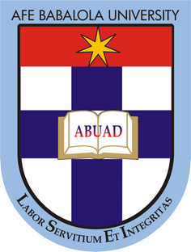

  

<h1 align="center">ABUAD SME (Smart School Environment)</h1>

The ABUAD Smart School Environment is a project carried out by [Nneji Ifeanyi](https://github.com/Nneji123) and [Ogunkuade Ayobamidele](https://github.com/devXcant). It is a comprehensive system designed to enhance the learning experience and improve safety and security within the Afe Babalola University Ado-Ekiti (ABUAD) campus. The system includes two primary components: the ABUAD Hostel Monitoring System (HMS) and the ABUAD Learning Management System (LMS).

# :computer: ABUAD Hostel Monitoring System (HMS)
The ABUAD HMS is a state-of-the-art system designed to monitor and manage student behavior within the university hostels. The system includes advanced technologies such as violence and smoking detection, as well as CCTV cameras and facial recognition software to identify and track offenders. The system is designed to help improve student safety and reduce incidents of misconduct.

# :pencil: ABUAD Learning Management System (LMS)
The ABUAD LMS is a comprehensive platform designed to enhance the learning experience for both students and lecturers. The system includes features such as course management, attendance monitoring, and document and assignment uploads. Lecturers can use the system to manage their courses and easily track attendance, while students can access course materials, view their attendance records, and submit assignments. The ABUAD LMS is designed to provide a seamless and intuitive learning experience for all users.

# :bulb: Motivation
The ABUAD Smart School Environment is motivated by the need to provide a safe and secure learning environment for students, as well as to enhance the learning experience through the use of advanced technologies. The system is designed to be user-friendly and accessible to all, while providing powerful tools and features to help students and lecturers achieve their academic goals.

# :information_source: More Information
For more information about the ABUAD Hostel Monitoring System and ABUAD Learning Management System, please visit the individual repositories:

- [ABUAD HMS](https://github.com/Nneji123/ABUAD-HMS)
- [ABUAD LMS](https://github.com/Nneji123/ABUAD-LMS)

Each repository contains detailed information about the features and functionality of the system, as well as installation and usage instructions.